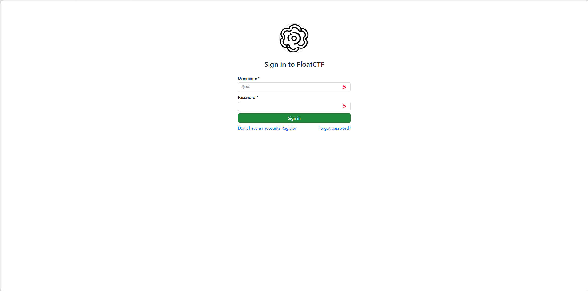
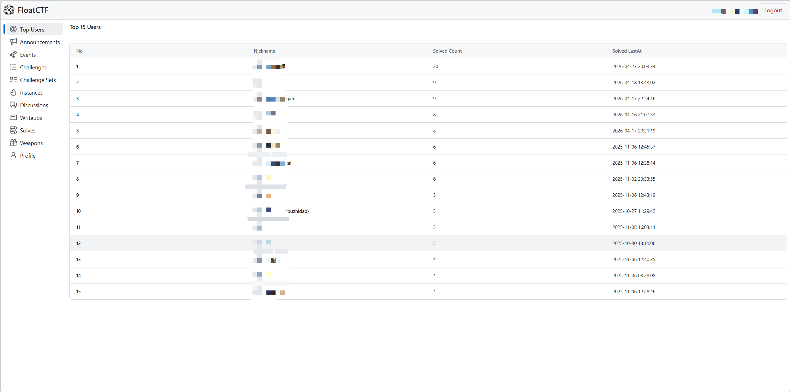
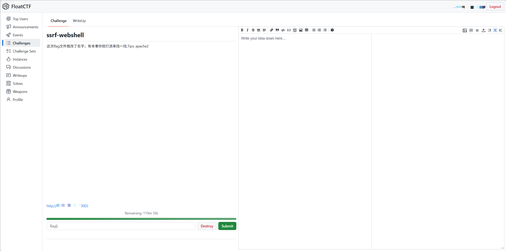
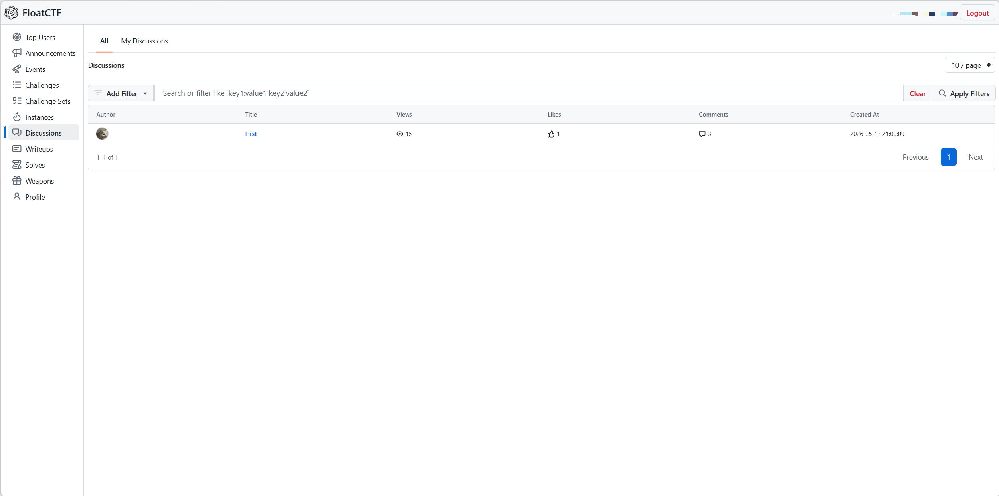
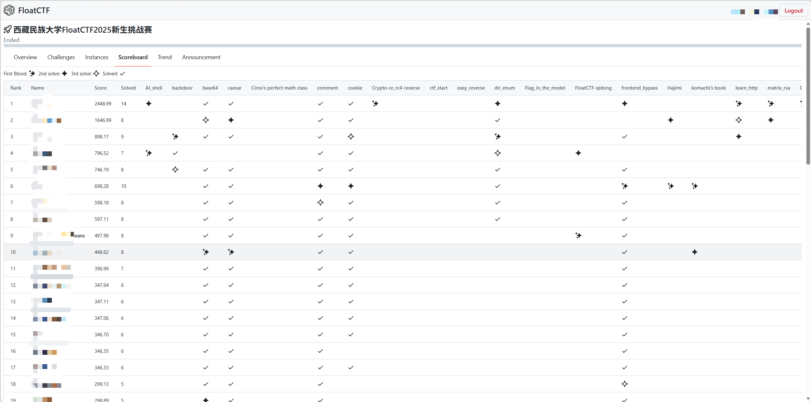
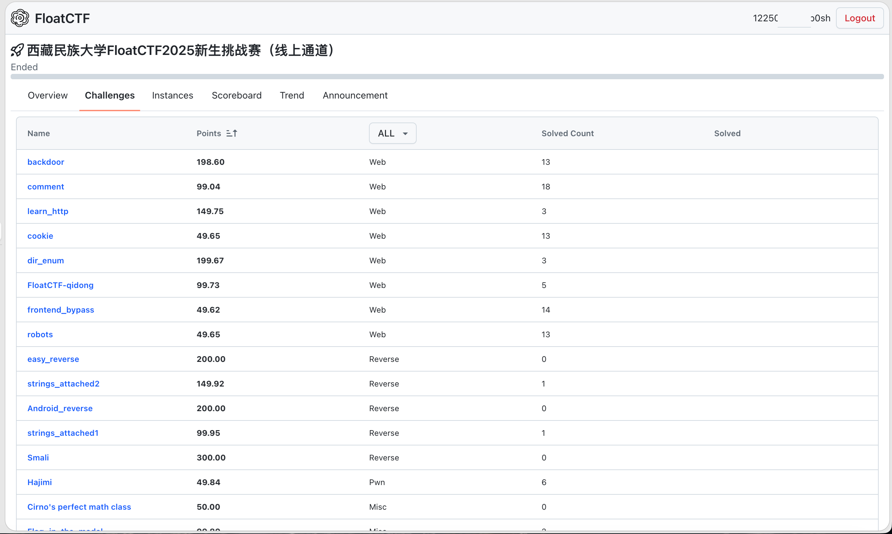
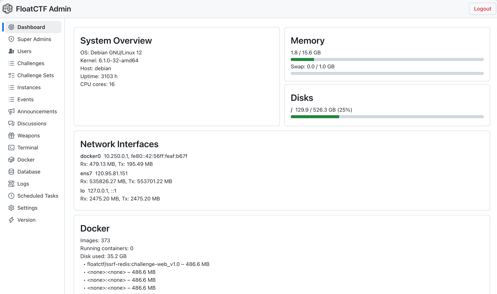
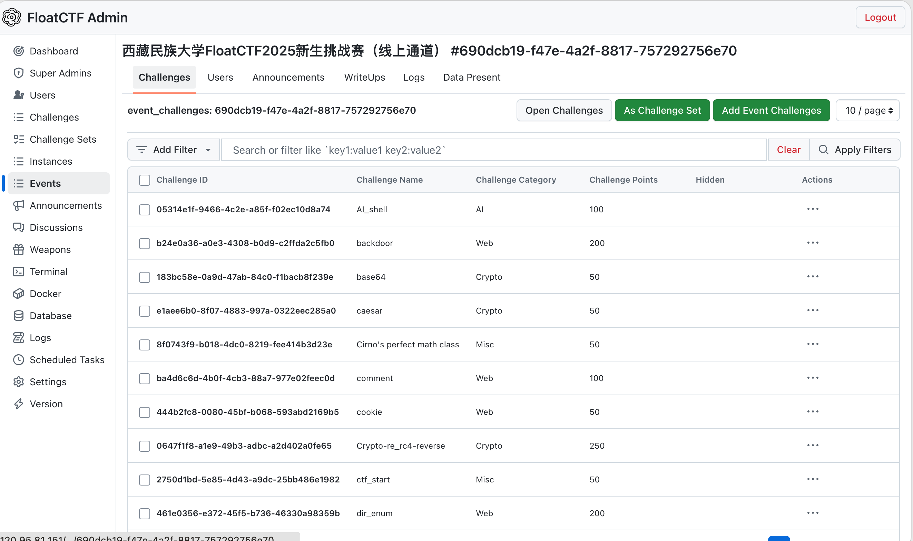
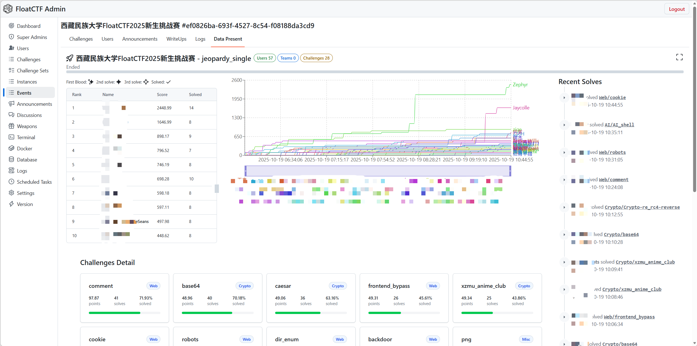

<h1 align="center">
  
  <br>
  FloatCTF
  <br>
</h1>

<h3 align="center">
A CTF Platform based on <a href="https://rust-lang.org/">Rust</a>.
</h3>


[](https://actix.rs/)
[](https://www.sea-ql.org/SeaORM/)
[](https://zed.dev/)


[](https://tanstack.com/router)
[](https://tanstack.com/query)

## Star History


## 目录

- [简述](#简述)
- [项目仓库](#项目仓库)
- [架构说明](#架构说明)
- [环境要求](#环境要求)
- [生产安装与部署](#生产安装与部署)
- [发布渠道（crates.io / GitHub Release）](#发布渠道cratesio--github-release)
- [环境初始化](#环境初始化)
- [快速开始](#快速开始)
  - [1. 克隆项目](#1-克隆项目)
  - [2. 配置服务（TOML）](#2-配置服务toml)
  - [3. 启动开发环境](#3-启动开发环境)
  - [4. 访问平台](#4-访问平台)
- [功能展示](#功能展示)
  - [用户端](#用户端)
  - [管理端](#管理端)
- [核心功能](#核心功能)
  - [用户端](#用户端-1)
  - [管理端](#管理端-1)
- [AWD 攻防对抗](#awd-攻防对抗)
- [技术栈](#技术栈)
- [技术亮点](#技术亮点)
- [目录结构](#目录结构)
- [服务说明](#服务说明)
- [常用命令](#常用命令)
- [常用开发命令](#常用开发命令)
- [运维速查](#运维速查)
- [AI 开发手册](#ai-开发手册)
- [故障排查](#故障排查)
- [许可证](#许可证)

## 简述

基于 Rust 的开源 CTF 实训及竞赛平台

## 项目仓库

FloatCTF 采用 Monorepo 结构，应用、共享 crate 和仓库级工具统一维护：

| 仓库                                                                   | 说明                                      |
| ---------------------------------------------------------------------- | ----------------------------------------- |
| **[floatctf](https://github.com/FloatCTF/floatctf)**                   | FloatCTF Monorepo（当前仓库）             |
| `apps/api`                                                             | 后端 API（Rust / Actix Web）              |
| `apps/web`                                                             | 前端（React）                             |
| `crates/fcmc`                                                          | 共享容器管理与出题工具（crates.io: `cargo install fcmc`） |
| `crates/awd-flagserver`                                                | AWD FlagServer 独立服务                  |
| `crates/awd-judgeserver`                                               | AWD JudgeServer 独立服务                 |
| [floatctf-develop](https://github.com/FloatCTF/floatctf-develop)       | 开发环境（DevContainer）                  |
| [floatctf-installer](https://github.com/FloatCTF/floatctf-installer)   | 主机安装脚本                              |
| [floatctf-challenges](https://github.com/FloatCTF/floatctf-challenges) | 题目仓库                                  |
| [challenge-template](https://github.com/FloatCTF/challenge-template)   | 出题教程 / 题目模板                       |
| [fcmc](https://github.com/FloatCTF/fcmc)                               | 容器管理 / 出题工具（已发布 [crates.io](https://crates.io/crates/fcmc)，`cargo install fcmc`） |
| [floatctf-challenge-creator](https://github.com/FloatCTF/floatctf-challenge-creator) | Claude Code 出题 Skill    |

**赛事相关：**

| 仓库                                                                                                 | 说明         |
| ---------------------------------------------------------------------------------------------------- | ------------ |
| [challenges-xxxxxxxx-xxxxx-template](https://github.com/FloatCTF/challenges-xxxxxxxx-xxxxx-template) | 赛事模板     |
| [challenges-202510-freshcup](https://github.com/FloatCTF/challenges-202510-freshcup)                 | 历届赛事题目 |

## 架构说明

生产部署是「原生进程 + Docker 容器」的混合架构：

```
Browser
  ↓
nginx（容器，network_mode: host）
  ↓
FloatCTF API（原生 systemd 进程）
  ├── PostgreSQL（容器）
  ├── RustFS（容器）
  └── AWD Runtime（GameBox / FlagServer / JudgeServer + nftables + WireGuard）
```

systemd 为 **2 个服务 + 1 个聚合目标**（不是 3 个独立守护进程）：

| 单元 | 内容 |
| ----- | ---- |
| `floatctf-api.service` | 原生 API 进程 |
| `floatctf-infra.service` | postgres / rustfs / nginx 容器（`--wait` 就绪） |
| `floatctf.target` | 聚合目标 |

> 开发模式仍可全部容器化运行（`mise run infra:up` + `dev:api`/`dev:web`），见「快速开始」。

## 环境要求

**生产部署**（见 [INSTALL.md](./INSTALL.md)）：

- systemd Linux（Arch 已完整真实验证）
- Docker + Docker Compose
- nftables、WireGuard（wireguard-tools）、iproute2
- IPv4 转发 + `br_netfilter`（`install.sh` 自动检查/持久化）

**开发环境**：Docker 与 Docker Compose、约 10GB 可用磁盘空间。

## 生产安装与部署

> 完整权威指南见 **[INSTALL.md](./INSTALL.md)**。以下是极简入口。

**全新主机（一键安装）**：

```bash
sudo ./scripts/install.sh   # 下载 release tarball + 主机初始化(幂等) + 部署
systemctl status floatctf.target
```

**升级 / 重部署**（保留数据与密钥）：

```bash
sudo ./scripts/install.sh   # 幂等：已初始化的部分自动 skip，重下载最新 release 并部署
```

**仅初始化（开发环境）**：只做主机初始化，跳过下载与部署；之后自行起
docker-compose + 本地 vite / cargo run：

```bash
sudo ./scripts/install.sh --init-only
```

**卸载**：

```bash
sudo /home/floatctf/uninstall.sh          # 安全卸载（保留 PG/RustFS 数据、config、secrets）
sudo /home/floatctf/uninstall.sh --purge  # 永久删除全部 FloatCTF 数据（需确认 PURGE FLOATCTF）
```

`install.sh` 每次成功部署都会把 `scripts/uninstall.sh` 安装到
`/home/floatctf/uninstall.sh`（root:floatctf 0750）。`scripts/clean.sh` 可清理源码
签出里的再生构建产物（`./scripts/clean.sh [--all]`）。

> 现代部署请使用 `install.sh` / `clean.sh` / `uninstall.sh` 这套生命周期脚本。

## 发布渠道（crates.io / GitHub Release）

FloatCTF 提供两条获取工具/二进制的渠道（用于出题工具与平台二进制分发，平台部署仍走
`scripts/` 生命周期脚本）：

- **crates.io**：`fcmc` 已发布到 [crates.io](https://crates.io/crates/fcmc)，`cargo install fcmc`
  即可安装出题/容器管理工具；后端 crate `floatctf` 亦已具备发布元数据。
- **GitHub Release**：打 `v*` tag 触发 `.github/workflows/release.yml`，产出自包含
  tarball `floatctf-<version>.tar.gz`（bin + web + compose + 配置/nginx 模板 + 迁移 +
  systemd + uninstall），由 `install.sh` 下载部署。

> crates.io 发布流程与顺序（先 `fcmc` 后 `floatctf`）见 `chore/crates-io-publish-guide.md`。

## 环境初始化

仓库级开发命令由 `mise` 管理。先安装仓库固定版本的 Rust、Node 和 pnpm，然后执行：

```bash
mise run install
```

## 快速开始

### 1. 克隆项目

```bash
git clone https://github.com/FloatCTF/floatctf.git
cd floatctf
```

### 2. 配置服务（TOML）

API 配置由 TOML 文件提供：`mise` 通过 `FLOATCTF_CONFIG` 自动指向 `apps/api/config/development.toml`。按需修改其中的 `server`、`database`、`rustfs`、`auth` 等段落；敏感值（数据库密码、RustFS 密钥、JWT secret）不得提交到仓库。首次使用请确保该文件存在，缺失时按本机环境创建。

PostgreSQL、RustFS、Nginx 等基础设施的端口与挂载配置见 `infra/compose/compose.dev.yml`。

### 3. 启动开发环境

```bash
mise run infra:up
mise run dev:api
mise run dev:web
```

也可以使用 `mise run dev` 同时启动 API 和 Web。数据库 Schema 变更通过 SQL 迁移管理（`apps/api/src/sql/migrations/`）：

```bash
mise run db:migration:new <迁移名称>  # 新建迁移 SQL 模板
mise run db:migration:merge           # 重新生成合并脚本 merged.sql
# 将新迁移应用到开发库（迁移文件为幂等 SQL）
docker compose -f infra/compose/compose.dev.yml exec floatctf-dev-db \
  psql -U postgres -d floatctf_db -v ON_ERROR_STOP=1 \
  -f /dev/stdin < apps/api/src/sql/migrations/<新迁移>.sql
```

### 4. 访问平台

通过 Nginx 入口访问 http://localhost:7780 （`/` 转发到 Web，`/api/` 转发到 API）。Web 开发服务器也可直接访问 http://localhost:3000 。

## 功能展示

### 用户端

|            登录页面             |          天梯排行榜          |             做题页              |
| :-----------------------------: | :--------------------------: | :-----------------------------: |
|  |  |  |

|              讨论页              |             积分看板              |
| :------------------------------: | :-------------------------------: |
|  |  |

|           比赛题目页           |
| :----------------------------: |
|  |

### 管理端

|              概览              |
| :----------------------------: |
|  |

|            赛题管理            |            数据大屏             |
| :----------------------------: | :-----------------------------: |
|  |  |

## 核心功能

### 用户端

- **登录注册** — 学号注册、JWT 令牌鉴权、Argon2 密码加密、密码重置
- **首页 / 天梯排行榜** — 实时展示解题排名，长期积累激发自主学习动力
- **题单 / 做题** — 按 Web / Pwn / Crypto / Reverse / Misc 分类浏览，点击开启即自动创建独立 Docker 容器；支持教师发布"题单"组合专项训练
- **Discussion 讨论** — 在线论坛，支持同学间进行彼此学习交流
- **比赛 / 积分看板** — 支持 Jeopardy（解题赛）和 AWD（攻防对抗）两种赛制，提供实时积分看板、得分趋势图、一血标记、赛事公告

### 管理端

- **赛事概览** — 可视化系统状态看板，实时展示服务器负载、内存/磁盘使用率、网络流量
- **赛事细节管理** — 题目增删改查、Docker 镜像配置、端口映射、附件上传、积分规则配置
- **日志** — 操作日志与审计记录查询
- **Docker** — 查看所有运行中的容器实例，支持强制销毁异常容器，释放服务器资源
- **Tasks** — 任务队列管理与调度

## AWD 攻防对抗

AWD（Attack With Defense）是平台的核心特色功能。通过 Docker 自定义网桥与 WireGuard VPN 构建混合网络架构，为每个参赛队伍分配独立虚拟子网，实现环境隔离与流量可控。选手通过 WireGuard 客户端接入竞赛内网，攻击其他队伍靶机、防御己方靶机，还原真实内网攻防场景。

## 技术栈

| 模块     | 技术选型                               | 说明                                 |
| -------- | -------------------------------------- | ------------------------------------ |
| 后端语言 | Rust                                   | 系统级高性能语言，编译期内存安全保障 |
| Web 框架 | Actix Web                              | 异步高并发 Web 框架                  |
| ORM      | SeaORM                                 | 类型安全的异步 ORM                   |
| 数据库   | PostgreSQL 17                          | 关系型数据库                         |
| 对象存储 | RustFS                                 | S3 兼容对象存储                      |
| 前端框架 | React + TanStack Query + Primer Design | 流畅交互体验                         |
| 容器技术 | Docker / Docker Compose                | 题目环境隔离与部署                   |
| VPN      | WireGuard                              | AWD 竞赛网络隔离                     |
| 身份认证 | JWT + Argon2                           | 令牌鉴权 + 高强度密码哈希            |
| 反向代理 | Nginx 1.26                             | 静态文件服务与 API 代理              |

## 技术亮点

- **高性能** — Rust + Actix Web 异步架构，数百人同时提交 Flag 时 API 响应延迟可控制在 100ms 以内
- **安全可靠** — Rust 所有权机制从编译期杜绝内存安全隐患；JWT 权限校验、Argon2 密码加密、容器资源限制多层保障
- **环境隔离** — 每道题目独立 Docker 容器，秒级启动、自动超时回收；AWD 模式下 WireGuard 子网隔离
- **动态积分** — 基于平方根函数的积分衰减算法，分值随解题人数非线性下降，兼顾区分度与公平性
- **一键部署** — `scripts/install.sh` 一键安装（下载 release tarball → 主机初始化(幂等) → 部署 → systemd → API）；`clean.sh`/`uninstall.sh` 完善生命周期

## 目录结构

```text
floatctf/
├── apps/
│   ├── api/             # Rust API（config/ 为 TOML 配置，src/sql/migrations/ 为 SQL 迁移）
│   └── web/             # React 前端
├── crates/
│   ├── fcmc/            # 共享 Rust crate / CLI
│   ├── awd-flagserver/  # AWD FlagServer 独立服务
│   └── awd-judgeserver/ # AWD JudgeServer 独立服务
├── infra/               # Compose / Nginx / systemd / Docker 配置
├── scripts/             # 生命周期脚本：install / clean / uninstall
├── docs/                # 项目文档
├── INSTALL.md           # 生产安装与运维权威指南
├── app/                 # 运行时数据（日志、上传、题目文件，git 忽略）
├── Cargo.toml           # Rust workspace
├── Cargo.lock           # 唯一 Rust lockfile
├── package.json         # 根 pnpm 入口
├── pnpm-workspace.yaml  # pnpm workspace
├── pnpm-lock.yaml       # 唯一前端 lockfile
└── mise.toml            # 统一任务入口
```

## 服务说明

**生产部署**（systemd，`/home/floatctf`）：

| 单元 | 内容 | 端口（默认，可经 `.env` 覆盖） |
| ----- | ---- | ---- |
| `floatctf-infra.service` | postgres / rustfs / nginx 容器 | PG 5433 / RustFS 9000,9001 / HTTP 80,443 |
| `floatctf-api.service` | 原生 API 进程 | API 9090 |

**开发模式**（`mise run infra:up` / `dev:api` / `dev:web`）：

| 服务              | 镜像              | 端口         | 说明                                                                             |
| ----------------- | ----------------- | ------------ | -------------------------------------------------------------------------------- |
| `floatctf-dev-db` | PostgreSQL 17     | 5432         | 数据库，持久化卷 `pgdata`                                                        |
| `floatctf-dev-rustfs` | rustfs/rustfs | 9000 / 9001  | S3 兼容对象存储；`floatctf-public`（公共资源）、`floatctf-private`（Writeups）   |
| `floatctf-dev-nginx` | Nginx 1.26        | 7780         | 反向代理：`/` → Web(3000)、`/api/` → API(9090)、`/public/`、`/private/` → RustFS |
| `floatctf-api`    | 本地 cargo 进程   | 9090         | 后端 API（开发模式），连接 PostgreSQL 和 RustFS                                  |

## 常用命令

基础设施生命周期通过 mise 任务管理：

```bash
mise run infra:up
mise run infra:logs
mise run infra:down
```

数据库迁移与模型生成：

```bash
mise run db:migration:new <名称>  # 新建 SQL 迁移
mise run db:migration:merge       # 重新生成 merged.sql
mise run db:gen                   # 从数据库重新生成 SeaORM 实体与 Web 类型
```

## 故障排查

| 问题               | 排查方向                                                                                                                                         |
| ------------------ | ------------------------------------------------------------------------------------------------------------------------------------------------ |
| API 无法连接数据库 | 检查 `apps/api/config/development.toml` 中 `database.url`；确认 PostgreSQL 运行中：`docker compose -f infra/compose/compose.dev.yml ps`             |
| RustFS 连接问题    | 检查 TOML 中 `rustfs.endpoint_url` 是否与本机映射端口一致；确认容器运行中：`docker compose -f infra/compose/compose.dev.yml ps floatctf-dev-rustfs` |
| Nginx 返回 502     | 确认 API（9090）与 Web（3000）开发进程已启动；Nginx 通过 `host.docker.internal` 访问宿主机端口                                                   |
| SSL 证书错误       | 默认为自签名证书；将 `app/keys/fullchain.pem` 和 `app/keys/privkey.pem` 替换为正式证书                                                            |

## 常用开发命令

```bash
mise run install       # 安装依赖
mise run dev:web       # 启动前端
mise run fmt           # Rust 格式检查
mise run lint          # Rust 与 Web 静态检查
mise run test          # Rust 与 Web 测试
mise run check         # 完整检查
mise run build         # 构建 Rust 与 Web
```

数据库迁移是显式操作：新建见 `mise run db:migration:new`，合并见 `mise run db:migration:merge`，并将生成的 SQL 手动应用到数据库（见上文「3. 启动开发环境」）。

## 运维速查

生产环境生命周期命令（完整指南见 [INSTALL.md](./INSTALL.md)）：

```bash
systemctl status floatctf.target        # 平台整体状态
sudo systemctl restart floatctf-api     # 重启 API
sudo systemctl restart floatctf-infra   # 重启 infra 容器
journalctl -fu floatctf-api             # 查看 API 日志

sudo /home/floatctf/uninstall.sh        # 安全卸载（保留数据/密钥）
sudo /home/floatctf/uninstall.sh --purge  # 永久删除全部 FloatCTF 数据（需确认）
```

清理源码构建产物：`./scripts/clean.sh`（`--all` 额外清理依赖与开发运行时数据）。

## AI 开发手册

仓库为 AI 编码助手（Pi Coding Agent / Claude Code 等）维护了完整开发手册。动手前先读入口文档，再按任务类型选择对应指南：

| 文档 | 用途 |
| --- | --- |
| [AI 工作手册（AGENTS.md）](AGENTS.md) | 仓库入口：铁律、常用命令、开发环境速记 |
| [手册索引与阅读顺序](docs/agents/README.md) | 文档总览与按任务类型选择的阅读路径 |
| [架构速览](docs/agents/ARCHITECTURE.md) | 模块分层、关键类型、配置体系、数据流 |
| [开发新功能](docs/agents/ADD-FEATURE.md) | 8 步流程 + 测试清单 |
| [修 bug](docs/agents/FIX-BUG.md) | 复现/定位/根因/最小修复/回归 |
| [改数据库](docs/agents/DATABASE.md) | 迁移 → 应用 → 实体/类型再生成 |
| [前端数据页面](docs/agents/DATA-FETCHING.md) | 缓存分级、keepPreviousData、queryKey 失效 |
| [测试规范](docs/agents/TESTING.md) | 测试层级、写法、禁忌 |

## 许可证

本项目以 [GNU AGPLv3](LICENSE) 协议发布。Copyright (C) 2025-2026 fb0sh@outlook.com
