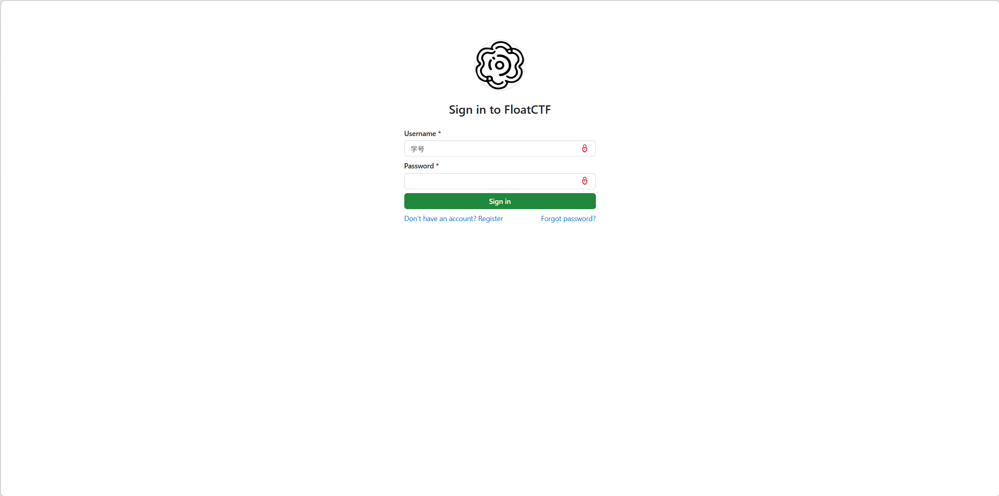
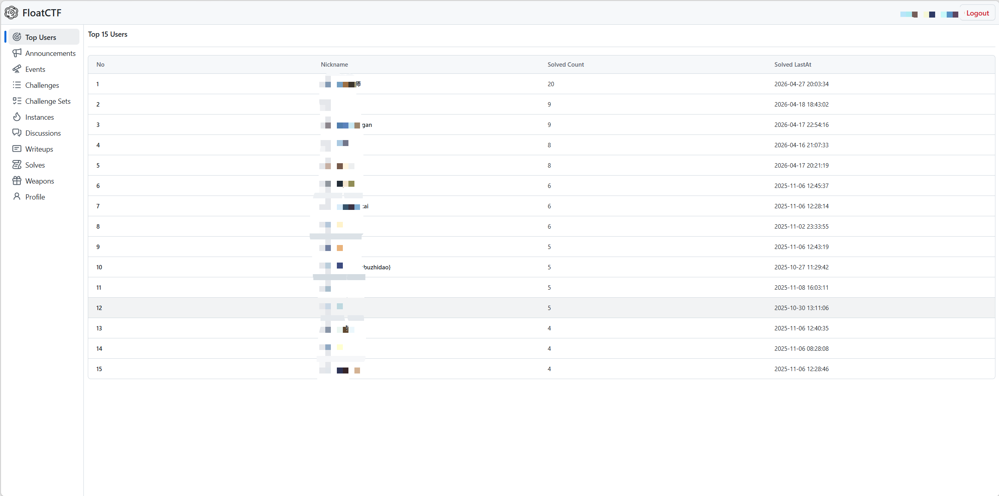
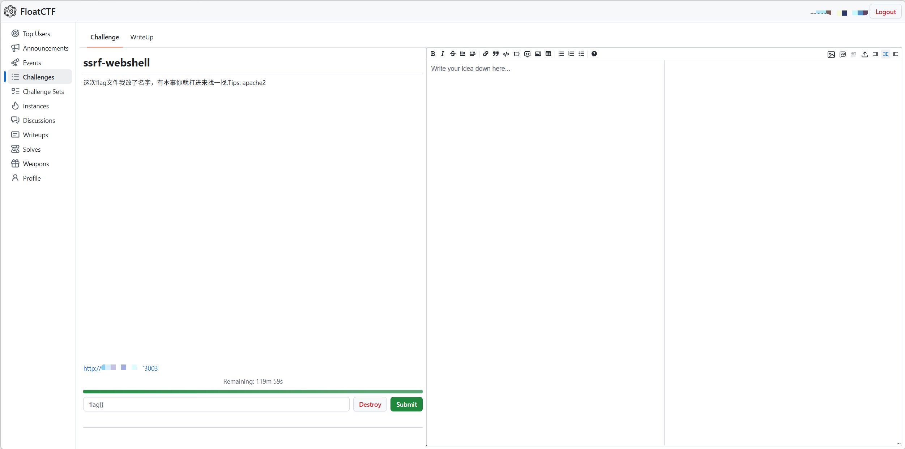
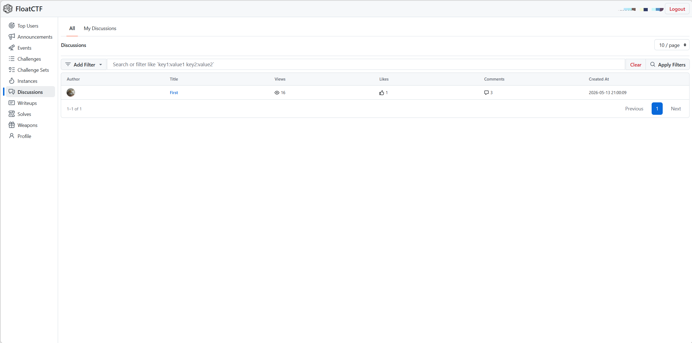
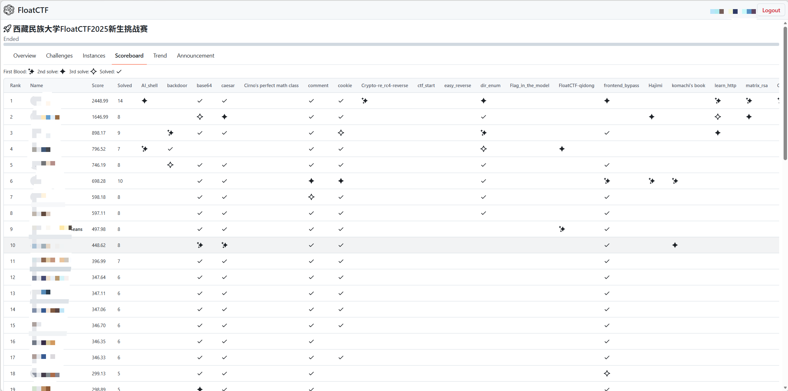
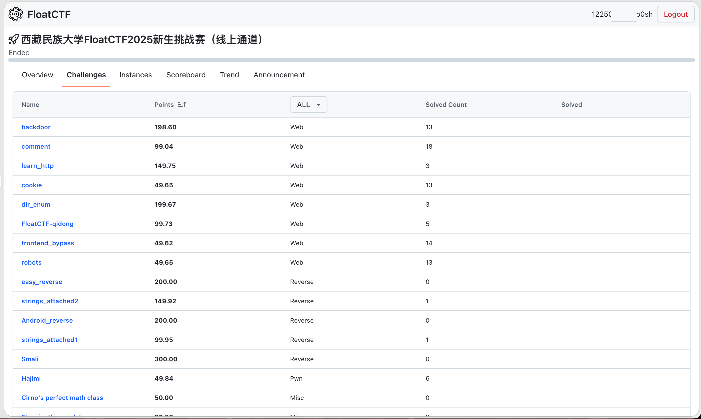
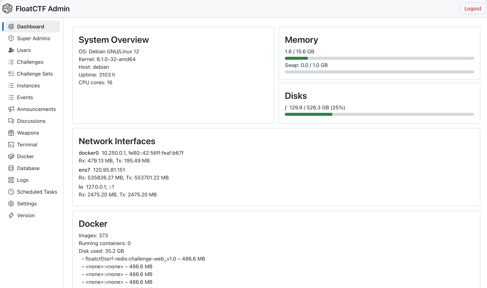
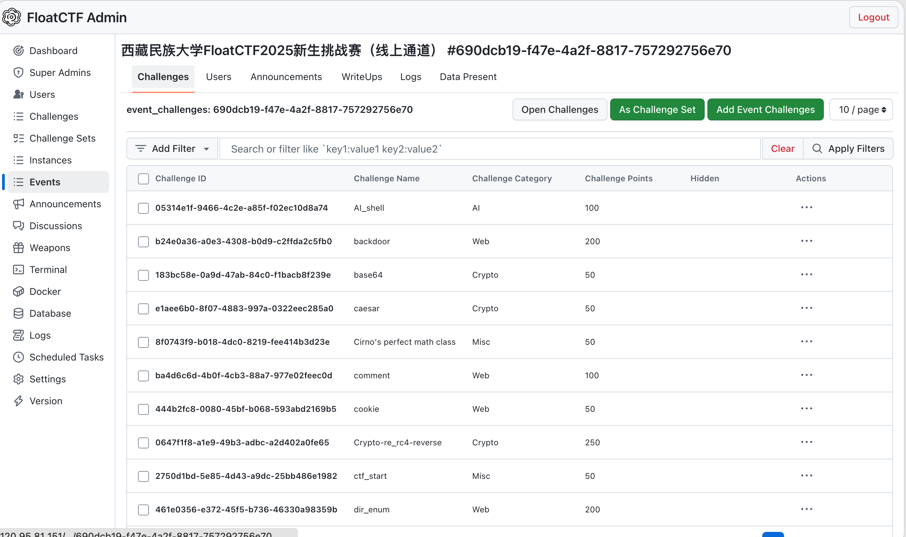
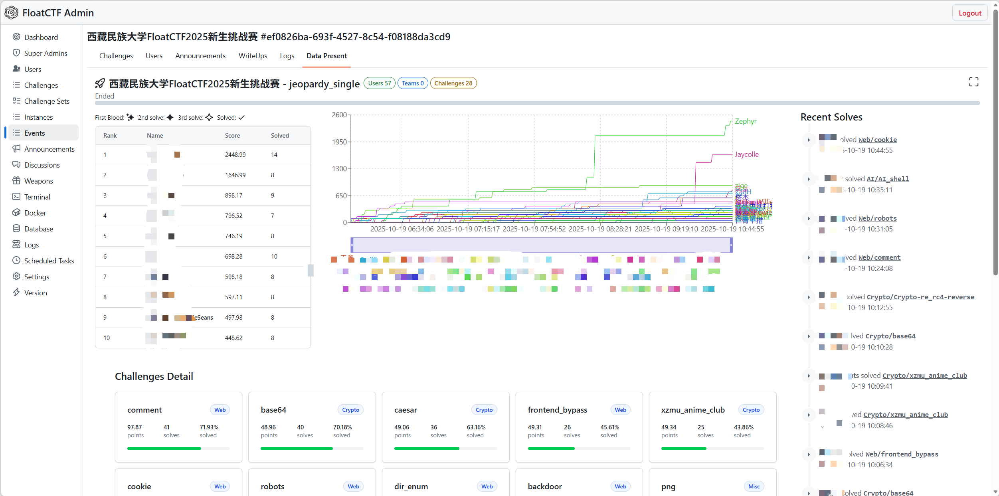

<h1 align="center">
  
  <br>
  FloatCTF
  <br>
</h1>

<h3 align="center">
A CTF Platform based on <a href="https://rust-lang.org/">Rust</a>.
</h3>


[](https://actix.rs/)
[](https://www.sea-ql.org/SeaORM/)
[](https://zed.dev/)


[](https://tanstack.com/router)
[](https://tanstack.com/query)

## Star History


## 目录

- [简述](#简述)
- [项目仓库](#项目仓库)
- [架构说明](#架构说明)
- [环境要求](#环境要求)
- [生产安装与部署](#生产安装与部署)
- [发布渠道（crates.io / GitHub Release / GHCR）](#发布渠道cratesio--github-release--ghcr)
- [开发指南](#开发指南)
- [功能展示](#功能展示)
- [核心功能](#核心功能)
- [AWD 攻防对抗](#awd-攻防对抗)
- [技术栈](#技术栈)
- [技术亮点](#技术亮点)
- [目录结构](#目录结构)
- [服务说明](#服务说明)
- [常用开发命令](#常用开发命令)
- [故障排查](#故障排查)
- [运维速查](#运维速查)
- [AI 开发手册](#ai-开发手册)
- [许可证](#许可证)

## 简述

基于 Rust 的开源 CTF 实训及竞赛平台

## 项目仓库

FloatCTF 采用 Monorepo 结构，应用、共享 crate 和仓库级工具统一维护：

| 仓库                                                                   | 说明                                      |
| ---------------------------------------------------------------------- | ----------------------------------------- |
| **[floatctf](https://github.com/FloatCTF/floatctf)**                   | FloatCTF Monorepo（当前仓库）             |
| `apps/api`                                                             | 后端 API（Rust / Actix Web）              |
| `apps/web`                                                             | **Web bootstrap**：解析并加载已安装前端（无 React / 无 UI） |
| `frontends/default`                                                    | **官方前端**：当前完整 UI（React + TanStack Router + Primer） |
| `packages/sdk`                                                         | `@floatctf/sdk`：框架无关的客户端（传输 / 错误模型 / 领域 API / SSE / DTO） |
| `packages/react`                                                       | `@floatctf/react`：可选 headless React 绑定（无 UI） |
| `packages/frontend-runtime`                                            | `@floatctf/frontend-runtime`：前端制品 / 运行时契约与 bootstrap 加载器 |
| `crates/fcmc`                                                          | 共享容器管理与出题工具（crates.io: `cargo install fcmc`） |
| `crates/awd-flagserver`                                                | AWD FlagServer 独立服务                  |
| `crates/awd-judgeserver`                                               | AWD JudgeServer 独立服务                 |
| `crates/awdp-judgeserver`                                              | AWDP（攻防+补丁）JudgeServer 独立服务      |
| `crates/helper-protocol`                                             | API ↔ helper Host RPC 协议                  |
| `crates/floatctf-helper`                                             | Docker + 网络宿主控制面守护进程             |
| [floatctf-develop](https://github.com/FloatCTF/floatctf-develop)       | 开发环境（DevContainer）                  |
| [floatctf-installer](https://github.com/FloatCTF/floatctf-installer)   | 主机安装脚本                              |
| [floatctf-challenges](https://github.com/FloatCTF/floatctf-challenges) | 题目仓库                                  |
| [challenge-template](https://github.com/FloatCTF/challenge-template)   | 出题教程 / 题目模板                       |
| [fcmc](https://github.com/FloatCTF/fcmc)                               | 容器管理 / 出题工具（已发布 [crates.io](https://crates.io/crates/fcmc)，`cargo install fcmc`） |
| [floatctf-challenge-creator](https://github.com/FloatCTF/floatctf-challenge-creator) | Claude Code 出题 Skill    |

**赛事相关：**

| 仓库                                                                                                 | 说明         |
| ---------------------------------------------------------------------------------------------------- | ------------ |
| [challenges-xxxxxxxx-xxxxx-template](https://github.com/FloatCTF/challenges-xxxxxxxx-xxxxx-template) | 赛事模板     |
| [challenges-202510-freshcup](https://github.com/FloatCTF/challenges-202510-freshcup)                 | 历届赛事题目 |

## 架构说明

FloatCTF 采用「容器化应用面 + 独立宿主控制面」架构。生产 API、PostgreSQL、Redis、RustFS、Caddy 都由 Docker Compose 管理；只有需要操作宿主 Docker/网络的 `floatctf-helper` 常驻 systemd：

```text
Internet
  ↓
Caddy container :80/:443
  ├── Web static
  ├── /api/* ───────────────► FloatCTF API container :9090
  └── object paths ─────────► RustFS
                                   │
FloatCTF API container            ├── PostgreSQL / Redis / RustFS（Compose DNS）
  ├── non-root / cap_drop=ALL / read-only rootfs
  ├── /run/floatctf/helper-control.sock ───────► Host RPC
  └── /run/floatctf/helper-docker.sock ► Docker policy proxy
                                              ↓
                                        floatctf-helper
                                        ├── docker group → Docker Engine
                                        └── CAP_NET_ADMIN
                                            ├── WireGuard
                                            ├── nftables
                                            ├── conntrack
                                            └── Docker FORWARD
```

生产 systemd 只管理宿主 helper 与 Compose 生命周期：

| 单元 | 内容 |
| --- | --- |
| `floatctf-helper.service` | 宿主控制面：Docker group + `CAP_NET_ADMIN` |
| `floatctf-infra.service` | `docker compose up/down`：API + PostgreSQL + Redis + RustFS + Caddy |
| `floatctf.target` | 聚合整个平台 |

API 不发布宿主 9090 端口。Caddy 在 Compose 网络中直接访问 `api:9090`；FlagServer/JudgeServer 通过独立 internal 网络 `fctf-platform-control` 访问 API 固定地址 `10.42.8.2:9090`，GameBox 不加入该网络。开发仍使用原生 `watchexec + setpriv` API，以保留快速热重载，同时与生产保持相同的 helper 权限边界。

Redis 与 PostgreSQL、RustFS 一样属于 API 的必需基础设施。API 启动时会主动 `PING` Redis，失败即停止启动；Redis 当前承载 realtime 跨节点扇出/全局 sequence、AWD 分布式限流、Web Terminal 一次性票据、scheduler 即时唤醒和 settings 热点缓存。

### 可插拔前端（Pluggable Frontends）

**前端 ≠ 主题**。一个前端是一个**完整的可替换浏览器应用**（自己的框架、路由、页面层级、
布局、导航、登录 UX、管理端 UX 与设计系统）；不同前端不要求有相同的页面或路由路径。

```text
FloatCTF Backend ── REST / SSE / Bearer ──► @floatctf/sdk
                                              │
                              ┌───────────────┴───────────────┐
                              ▼                               ▼
                       @floatctf/react                  （任意非 React 前端）
                              │                               │
                              └───────────► Frontend ◄────────┘
                    官方：frontends/default      第三方：独立仓库

@floatctf/frontend-runtime = 制品/运行时契约（框架无关）
apps/web                  = 极薄的 bootstrap 引导页
```

- 浏览器加载顺序：`bootstrap/index.html` → `GET /api/frontend` → 本地注册表
  `/__floatctf/frontends/registry.json` → 兼容性校验 → 注入样式 → 同源动态 import
  → `frontend.mount(context)`；任一步失败回退 `default`，再失败显示内置兜底页。
- 前端安装/升级/回滚是**运维 CLI**：`sudo $FLOATCTF_HOME/frontend.sh install <目录|Git URL|制品>`；
  激活是**管理端设置**（`FRONTEND_ACTIVE`）。浏览器不安装、不构建、不克隆。
- 破窗恢复：任意页面加 `?frontend=default`（只影响当前加载，不改设置，不需登录）。
- 第三方前端是**可信应用代码**：它运行在 FloatCTF 源下、会接触用户凭据；
  构建隔离只降低宿主风险，**不是**沙箱。

详见 [docs/frontend/ARCHITECTURE.md](docs/frontend/ARCHITECTURE.md)、
[DEVELOPING.md](docs/frontend/DEVELOPING.md)、[ARTIFACT.md](docs/frontend/ARTIFACT.md)。

**开发自己的 FloatCTF Frontend** → [docs/frontend/AI-FRONTEND-GUIDE.md](docs/frontend/AI-FRONTEND-GUIDE.md)
（用 AI 代理从零创建一个完整前端；能力清单见 [CAPABILITY-MATRIX.md](docs/frontend/CAPABILITY-MATRIX.md)）。
官方前端 `frontends/default` 只是**语义/行为参照**，不是视觉模板。

#### 前端实现

每个前端都有自己的 README（含**逐页截图**、路由一览、开发与构建方式）与原图目录 `docs/images/`。
官方前端随本仓库发布；第三方前端是**独立仓库**，通过前端管理器安装：

| 前端 | id | 位置 | 说明 | README | 截图 |
|---|---|---|---|---|---|
| Default | `default` | 本仓库 `frontends/default` | **官方完整前端**，随平台发布、注册表标记 `protected`、不可卸载，也是 `?frontend=default` 破窗的落点 | [README](frontends/default/README.md) | [docs/images](frontends/default/docs/images) |
| XZMU | `xzmu` | [FloatCTF/floatctf-frontend-xzmu](https://github.com/FloatCTF/floatctf-frontend-xzmu) | **西藏民族大学主题前端**（「民大红 · 鎏金」），零组件库、自研路由与 CSS 设计系统，覆盖全部 89 项 `required` 能力 | [README](https://github.com/FloatCTF/floatctf-frontend-xzmu/blob/main/README.md) | [docs/images](https://github.com/FloatCTF/floatctf-frontend-xzmu/tree/main/docs/images) |

> 新前端放在**自己的仓库**里，按 [ARTIFACT.md](docs/frontend/ARTIFACT.md) 打成制品后由
> `frontend.sh install` 安装（本仓库内的前端则放 `frontends/<名字>/`）。
> 两者都建议带上 README 与 `docs/images/`，方便使用者先看图再决定装不装。

## 环境要求

生产和完整开发环境都需要 Linux、systemd、Docker + Compose、nftables、WireGuard、iproute2、conntrack、iptables，以及 IPv4 转发和 `br_netfilter`。自动安装路径当前验证于 Arch Linux。

生产安装还要求：

- **`python3` ≥ 3.11（stdlib 自带 `tomllib`）** —— `migrate.sh` 用它解析配置。安装器在任何改动
  之前做能力检查（`python3 -c 'import tomllib'`），缺失即中止；**不会**也不需要 `pip install`。
- **出网**以拉取 release 产物与 GHCR 运行时镜像；离线宿主的本地构建 / `docker load` 逃生通道见
  [INSTALL.md](./INSTALL.md) 的「通道 B —— GHCR 运行时镜像」。

完整要求与宿主内核参数见 [INSTALL.md](./INSTALL.md) 和 [DEVELOPMENT.md](./DEVELOPMENT.md)。

## 生产安装与部署

权威指南见 **[INSTALL.md](./INSTALL.md)**；发布契约见 **[RELEASE.md](./RELEASE.md)**。

部署模型：生产把应用面全部收进 Docker Compose（API / PostgreSQL / Redis / RustFS / Caddy），
宿主只保留一个高权限控制面 `floatctf-helper`（systemd）。API 是非 root 容器、`cap_drop=ALL`、
read-only rootfs，**不挂 Docker socket**；Docker 与宿主网络（WireGuard / nftables / conntrack）
统一经 helper 的两个 Unix socket。前端是**可插拔制品**：`apps/web` 只是 bootstrap 引导页，
官方 UI 在 `frontends/default`，第三方前端按版本安装、由管理端激活。

v1.0 有**两条产物通道**（完整清单与核对方式见 [RELEASE.md](./RELEASE.md#0-本次发布的产物契约artifact-contract-v10)）：

- **GitHub Release 文件产物（11 个）**：`floatctf`、`floatctf-helper`、`web-dist.tar.gz`、
  `merged.sql`、`frontend.sh`、`install.sh`、`ops-tools.tar.gz`、`floatctf-sdk-<V>.tgz`、
  `floatctf-react-<V>.tgz`、`floatctf-frontend-runtime-<V>.tgz`、`SHA256SUMS`。
  安装器实际下载其中 6 个部署产物（API / helper / web-dist / merged.sql / frontend.sh / ops-tools）；
  `ops-tools.tar.gz` 内含 `backup.sh` / `restore.sh` / `db/migrate.sh` / `db/migrations/*.sql`。
- **GHCR OCI 运行时镜像（3 个）**：`ghcr.io/floatctf/awd-flagserver:<V>`、
  `ghcr.io/floatctf/awd-judgeserver:<V>`、`ghcr.io/floatctf/awdp-judgeserver:<V>`（awdp 已扁平化）。
  GHCR 是 AWD/AWDP 运行时镜像的**规范在线分发通道**（由 tag 触发的 release workflow 推送，
  `packages: write` 仅在 tag 发布路径）；本地构建默认仍用历史名 `floatctf/awd-flagserver:<tag>` 等。
  离线宿主可用逃生通道：`sudo bash scripts/build-runtime-images.sh --tag <V>`（本地名）或
  `--registry ghcr.io/floatctf --tag <V>`（规范名），再 `docker save` / `docker load`。

`<V>` = tag 去掉前导 `v`（`v1.0.0` → `1.0.0`）。

全新主机：

```bash
curl -fsSL   https://github.com/FloatCTF/floatctf/releases/download/<tag>/install.sh   -o install.sh
sudo env SITE_ADDRESS=ctf.example.com bash install.sh
sudo systemctl start floatctf.target
systemctl status floatctf.target
```

默认安装根为 `/var/lib/floatctf`，可用 `FLOATCTF_HOME` 覆盖。安装器只创建 `floatctf` **组**（辅助账号只有 `floatctf-helper`，供宿主控制面使用），用 release `floatctf` 二进制本地构建 `floatctf/api:<version>` runtime image，并以数值 `65532:<floatctf GID>` 运行 API 容器；helper 独占 Docker 与网络宿主权限。

备份与恢复（运维工具随 release 装在安装根）：

```bash
sudo /var/lib/floatctf/backup.sh --out <file>            # 归档为明文，务必保护介质
sudo /var/lib/floatctf/restore.sh <归档> --yes           # 覆盖既有安装需额外 --force
```

卸载：

```bash
sudo /var/lib/floatctf/uninstall.sh
sudo /var/lib/floatctf/uninstall.sh --purge
```

> ⚠️ **单控制面不变量（R1）—— 同一宿主/helper/Docker daemon 同一时刻只允许一个 FloatCTF 控制面（API）。**
> 第二套 API —— 包括开发栈、RC/测试栈或第二份生产安装 —— 会 reconcile 全局/固定命名的宿主资源
> （AWD 防火墙是单一全局 nft 表 `floatctf_awd`；AWDP 练习网络与容器名固定为 `fctf-awdp-practice` /
> `fctf-awdp-practice-judge`），从而干扰正在运行的实例。**这在 Phase 13 实测发生过**（第二个 API
> 重建了线上练习判题容器与网络一次），不是理论风险。
> **绝不要在承载生产实例的宿主上启动开发 / RC / 测试 API。**

`install.sh --help` 的完整开关、运行时镜像获取（含 `--skip-runtime-images`）与升级语义，
见 [INSTALL.md §6–§7](./INSTALL.md)。

## 发布渠道（crates.io / GitHub Release / GHCR）

- **crates.io**：`fcmc` 可通过 `cargo install fcmc` 安装。
- **GitHub Release**：`v*` tag 触发 `.github/workflows/release.yml`，构建并发布 11 个文件产物（API binary、helper、Web 静态文件、fresh-production `merged.sql`、`frontend.sh`、`install.sh`、`ops-tools.tar.gz`、三个 `@floatctf/*` tarball 与 `SHA256SUMS`）。`workflow_dispatch` 默认只上传 workflow artifact，不创建 Release。
- **GHCR（OCI 镜像）**：同一条 tag 路径推送 3 个 AWD/AWDP 运行时镜像
  （`ghcr.io/floatctf/{awd-flagserver,awd-judgeserver,awdp-judgeserver}:<V>`）。
  `packages: write` **只**在 tag 发布路径上；PR / 分支 dispatch / RC 永不推送镜像。
- CI 还会实际构建一次生产 API runtime image；部署时 installer 用同一 Dockerfile 在目标机生成 `floatctf/api:<version>`。

> **尚未发布**：截至 Phase 13.1，不存在 `v1.0.0` tag / GitHub Release / npm 发布 / GHCR 镜像推送。
> 人工发布清单（含两条通道的核对步骤）见 [RELEASE.md](./RELEASE.md)。

## 开发指南

FloatCTF 只有一套完整开发环境。详细说明见 **[DEVELOPMENT.md](./DEVELOPMENT.md)**。

首次：

```bash
curl https://mise.run | sh
# 按 mise 提示激活 shell

git clone https://github.com/FloatCTF/floatctf.git
cd floatctf
mise run setup
```

`setup` 会准备固定工具链、Docker / WireGuard / nftables、`floatctf` 组和 `floatctf-helper` 账号（API 容器用数值 uid，不需要 `floatctf` 用户）。首次加入 `docker` / `floatctf` 组后重新登录一次。

日常开发只运行：

```bash
mise run dev
```

它会依次启动并等待 PostgreSQL / Redis / RustFS / Caddy，自动应用 migrations，然后启动 API watchexec 和 Vite HMR。

> ⚠️ **开发栈只能跑在开发机上。** `mise run dev` 会连宿主 Docker daemon 与 helper，并 reconcile
> 全局/固定命名的宿主资源；在承载生产实例的宿主上启动它会干扰线上运行（R1 不变量，
> 见上文「生产安装与部署」的警告块）。

常用命令：

```bash
mise run dev                 # 完整开发环境
mise run dev:down            # 停止开发基础设施
mise run dev:reset           # 清空开发数据并重建
mise run dev:logs            # 基础设施日志
mise run check               # fmt + lint + test
```

数据库 Schema 变更：

```bash
mise run db:migration:new <名称>
mise run db:migration:validate
mise run db:migration:apply
mise run db:gen
```

`merged.sql` 由 release 流程生成，日常开发启动直接从 migrations 构建 fresh DB。

开发地址：

| 服务 | 地址 |
| --- | --- |
| 统一入口 | `http://0.0.0.0:7780`（局域网使用宿主机 IP） |
| API（监听） | `0.0.0.0:9090`（本机直连仍用 `http://127.0.0.1:9090`） |
| Vite（监听） | `0.0.0.0:13000`（本机直连仍用 `http://127.0.0.1:13000`） |
| RustFS Console | `http://127.0.0.1:9001` |

内置开发账号：用户端用户名 `1000000`、密码 `testuser`（昵称 `testuser`）；管理端 `/admin` 使用 `sysadmin` / `FloatCTF@2025`。

## 功能展示

### 用户端

|            登录页面             |          天梯排行榜          |             做题页              |
| :-----------------------------: | :--------------------------: | :-----------------------------: |
|  |  |  |

|              讨论页              |             积分看板              |
| :------------------------------: | :-------------------------------: |
|  |  |

|           比赛题目页           |
| :----------------------------: |
|  |

### 管理端

|              概览              |
| :----------------------------: |
|  |

|            赛题管理            |            数据大屏             |
| :----------------------------: | :-----------------------------: |
|  |  |

> 以上是官方 **Default** 前端的截图。
> 其它前端有自己的视觉语言 —— 例如 `xzmu`（西藏民族大学「民大红 · 鎏金」主题），
> 它住在独立仓库 [FloatCTF/floatctf-frontend-xzmu](https://github.com/FloatCTF/floatctf-frontend-xzmu)：

|                登录                 |                 选手总览                  |               控制台总览                |
| :---------------------------------: | :---------------------------------------: | :-------------------------------------: |
|  |  |  |

完整逐页截图见 [xzmu 的 README](https://github.com/FloatCTF/floatctf-frontend-xzmu/blob/main/README.md#3-界面截图)。

## 核心功能

### 用户端

- **登录注册** — 学号注册、JWT 令牌鉴权、Argon2 密码加密、密码重置
- **首页 / 天梯排行榜** — 实时展示解题排名，长期积累激发自主学习动力
- **题单 / 做题** — 按 Web / Pwn / Crypto / Reverse / Misc 分类浏览，点击开启即自动创建独立 Docker 容器；支持教师发布"题单"组合专项训练
- **Discussion 讨论** — 在线论坛，支持同学间进行彼此学习交流
- **比赛 / 积分看板** — 支持 Jeopardy（解题赛）和 AWD（攻防对抗）两种赛制，提供实时积分看板、得分趋势图、一血标记、赛事公告

### 管理端

- **赛事概览** — 可视化系统状态看板，实时展示服务器负载、内存/磁盘使用率、网络流量
- **赛事细节管理** — 题目增删改查、Docker 镜像配置、端口映射、附件上传、积分规则配置
- **日志** — 操作日志与审计记录查询
- **Docker** — 查看所有运行中的容器实例，支持强制销毁异常容器，释放服务器资源
- **Tasks** — 任务队列管理与调度

## AWD 攻防对抗

AWD（Attack With Defense）是平台的核心特色功能。通过 Docker 自定义网桥与 WireGuard VPN 构建混合网络架构，为每个参赛队伍分配独立虚拟子网，实现环境隔离与流量可控。选手通过 WireGuard 客户端接入竞赛内网，攻击其他队伍靶机、防御己方靶机，还原真实内网攻防场景。

## 技术栈

| 模块     | 技术选型                               | 说明                                 |
| -------- | -------------------------------------- | ------------------------------------ |
| 后端语言 | Rust                                   | 系统级高性能语言，编译期内存安全保障 |
| Web 框架 | Actix Web                              | 异步高并发 Web 框架                  |
| ORM      | SeaORM                                 | 类型安全的异步 ORM                   |
| 数据库   | PostgreSQL 17                          | 关系型数据库                         |
| 对象存储 | RustFS                                 | S3 兼容对象存储                      |
| 前端框架 | React + TanStack Query + Primer Design | 流畅交互体验                         |
| 容器技术 | Docker / Docker Compose                | 题目环境隔离与部署                   |
| VPN      | WireGuard                              | AWD 竞赛网络隔离                     |
| 身份认证 | JWT + Argon2                           | 令牌鉴权 + 高强度密码哈希            |
| 反向代理 | Caddy 2                                | 自动 HTTPS、静态文件服务与 API 代理  |

## 技术亮点

- **高性能** — Rust + Actix Web 异步架构，数百人同时提交 Flag 时 API 响应延迟可控制在 100ms 以内
- **安全可靠** — Rust 所有权机制从编译期杜绝内存安全隐患；JWT 权限校验、Argon2 密码加密、容器资源限制多层保障
- **环境隔离** — 每道题目独立 Docker 容器，秒级启动、自动超时回收；AWD 模式下 WireGuard 子网隔离
- **动态积分** — 基于平方根函数的积分衰减算法，分值随解题人数非线性下降，兼顾区分度与公平性
- **一键部署** — `scripts/install.sh` 下载 6 个部署产物（API / helper / web-dist / merged.sql / frontend.sh / ops-tools）、拉取或本地构建运行时镜像、构建非 root API runtime image、创建 internal control network、渲染 Compose/Caddy/TOML，并由 systemd 管理 helper + Compose 生命周期；`uninstall.sh` 完整覆盖安全卸载与 purge（含活跃运行时守卫）

## 目录结构

```text
floatctf/
├── apps/
│   ├── api/                    # Rust / Actix Web API
│   └── web/                    # Web bootstrap 引导页（无 React / 无 UI）
├── frontends/
│   └── default/                # 官方前端：当前完整 UI（React + TanStack Router + Primer）
│                               # 第三方前端（如 xzmu）在自己的仓库里，不随本仓库发布
├── packages/                   # 可插拔前端平台（sdk / react / frontend-runtime）
├── crates/
│   ├── fcmc/                   # 容器管理 / 出题工具
│   ├── awd-flagserver/         # AWD FlagServer
│   ├── awd-judgeserver/        # AWD JudgeServer
│   ├── awdp-judgeserver/       # AWDP JudgeServer
│   ├── helper-protocol/        # API ↔ helper Host RPC 协议
│   └── floatctf-helper/        # Docker + 网络宿主控制面
├── infra/                      # Compose / Caddy / 生产配置参考 / Dockerfile
├── scripts/                    # setup / install / dev / frontend / backup / restore 生命周期脚本
├── docs/                       # 项目文档
├── DEVELOPMENT.md              # 开发权威指南
├── INSTALL.md                  # 生产安装与运维权威指南
├── RELEASE.md                  # 发布清单与产物契约
├── Cargo.toml                  # Rust workspace
├── pnpm-workspace.yaml         # pnpm workspace
└── mise.toml                   # 统一开发任务入口
```

## 服务说明

生产：

| 组件 | 身份 | 说明 |
| --- | --- | --- |
| `floatctf-helper.service` | `floatctf-helper` + docker group + `CAP_NET_ADMIN` | 唯一宿主高权限控制面 |
| `floatctf-infra.service` | systemd/root | 管理生产 Compose 生命周期 |
| `floatctf-api` container | numeric `floatctf` UID/GID，`cap_drop=ALL` | API；只访问 helper sockets，不挂 Docker socket |
| `floatctf-postgres` / `redis` / `rustfs` / `caddy` | Docker Compose | 数据面与公网入口 |
| `floatctf.target` | systemd | 聚合 helper + Compose stack |

开发：

```text
mise run dev
├── Docker Compose: PostgreSQL / Redis / RustFS / Caddy
├── floatctf-helper.service（宿主 systemd，setup 一次性安装）
├── API（当前开发者 UID + watchexec；启动时丢弃 docker group）
└── Web（Vite HMR）
```

## 常用开发命令

```bash
mise run setup
mise run dev
mise run dev:down
mise run dev:reset
mise run dev:logs
mise run fmt
mise run lint
mise run test
mise run check
mise run build
```

## 故障排查

| 问题 | 排查方向 |
| --- | --- |
| API 报 helper unavailable | `systemctl status floatctf-helper`，检查两个 helper socket 与 API 容器 `/run/floatctf` 挂载 |
| 开发 Compose Docker permission denied | setup 后重新登录，确认开发者在 `docker` 组；API 子进程会丢弃该组 |
| helper socket permission denied | 开发确认当前用户在 `floatctf` 组；生产确认 API numeric GID 与宿主 `floatctf` GID 一致 |
| API 无法连接数据库 | 开发检查 `floatctf-dev-db`；生产检查 `docker compose ... ps postgres` 与 Compose DNS |
| 开发 Caddy 502 | 确认 API 9090 / Vite 13000 已完成启动 |
| 生产 Caddy 502 | `docker compose -f /var/lib/floatctf/compose.prod.yml logs -f api caddy` |
| 生产 HTTPS 失败 | 检查 `SITE_ADDRESS`、DNS、80/443 与 `floatctf-caddy` 日志。**真实域名 TLS 未随 RC 验证（B4，产品负责人已接受）**，安装后由运维方自行验证 |
| 安装器报缺少 `python3` / `tomllib` | 需要 Python ≥ 3.11（stdlib `tomllib`）；升级系统 Python，不要 `pip install` |
| 安装器报缺少 AWD/AWDP 运行时镜像 | 见 [INSTALL.md §6.2](./INSTALL.md)（GHCR 规范通道 / 离线构建 / `--skip-runtime-images`） |
| AWD/AWDP 资源被莫名重建 | 疑似同宿主跑了第二套 API（dev/RC/第二份安装）；见 R1 不变量 |

## 运维速查

```bash
systemctl status floatctf.target
systemctl status floatctf-helper
systemctl status floatctf-infra
sudo systemctl restart floatctf-helper
sudo systemctl restart floatctf-infra
journalctl -fu floatctf-helper floatctf-infra

docker compose -f /var/lib/floatctf/compose.prod.yml ps
docker compose -f /var/lib/floatctf/compose.prod.yml logs -f api caddy

sudo /var/lib/floatctf/backup.sh --out <file>
sudo /var/lib/floatctf/restore.sh <归档> --yes

sudo /var/lib/floatctf/uninstall.sh
sudo /var/lib/floatctf/uninstall.sh --purge
```

## AI 开发手册

仓库为 AI 编码助手（Pi Coding Agent / Claude Code 等）维护了完整开发手册。动手前先读入口文档，再按任务类型选择对应指南：

| 文档 | 用途 |
| --- | --- |
| [AI 工作手册（AGENTS.md）](AGENTS.md) | 仓库入口：铁律、常用命令、开发环境速记 |
| [手册索引与阅读顺序](docs/agents/README.md) | 文档总览与按任务类型选择的阅读路径 |
| [架构速览](docs/agents/ARCHITECTURE.md) | 模块分层、关键类型、配置体系、数据流 |
| [开发新功能](docs/agents/ADD-FEATURE.md) | 8 步流程 + 测试清单 |
| [修 bug](docs/agents/FIX-BUG.md) | 复现/定位/根因/最小修复/回归 |
| [改数据库](docs/agents/DATABASE.md) | 迁移 → 应用 → 实体/类型再生成 |
| [前端数据页面](docs/agents/DATA-FETCHING.md) | 缓存分级、keepPreviousData、queryKey 失效 |
| [测试规范](docs/agents/TESTING.md) | 测试层级、写法、禁忌 |
| [创建新 Frontend（AI 手册）](docs/frontend/AI-FRONTEND-GUIDE.md) | **从零创建一个完整可插拔前端**：Default 仅语义参照、公共依赖边界、mount/auth/路由/SSE、完整性口径、验收流程 |
| [前端能力矩阵](docs/frontend/CAPABILITY-MATRIX.md) | 源码审计出的能力清单：公共 SDK 面 / Default 参照 / 实时 / 完整前端是否必需 |

## 许可证

本项目以 [GNU AGPLv3](LICENSE) 协议发布。Copyright (C) 2025-2026 fb0sh@outlook.com
